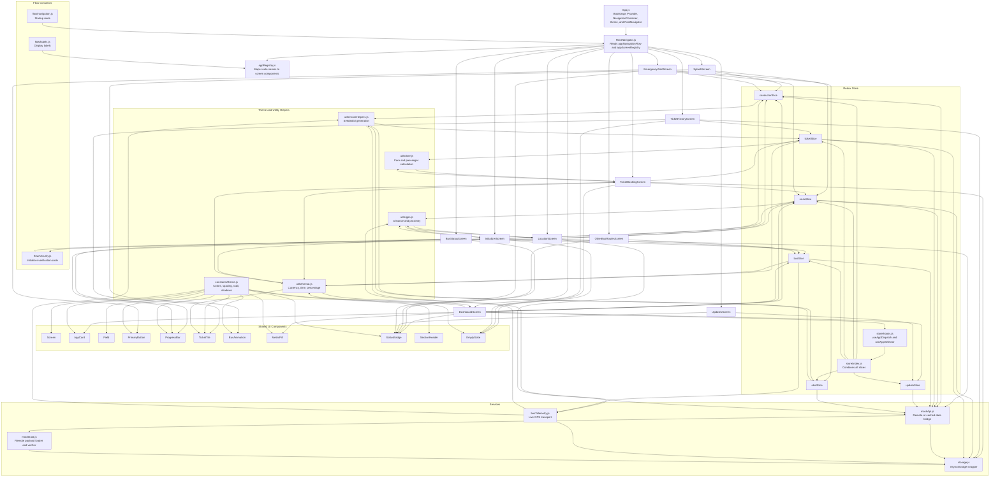

# ETM Interface Flow Diagram

## Reading Guide

- `App.js` owns the bootstrap shell and points into the navigator.
- `RootNavigator.js` consumes the registry and the startup route.
- `appRegistry.js` is the route-to-screen handoff.
- Screens consume shared UI components, store slices, services, and utility helpers.
- Store slices call services and utilities, then expose state to screens.
- The top-level `src` folder outside `ETM-Interface` is not part of this flow.
